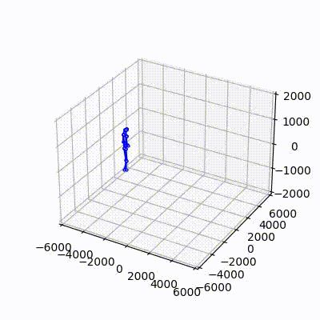
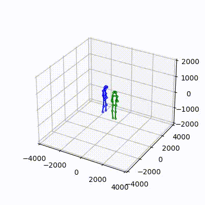

# Voxelpose-with-visualization
## About
We found 2 methods to visualize <a href="https://github.com/microsoft/voxelpose-pytorch">voxelpose-pytorch</a>.
1. <a href="https://github.com/open-mmlab/mmpose">mmpose</a>
2. <a href="https://github.com/microsoft/voxelpose-pytorch">Voxelpose itself</a>

## <a href="https://github.com/open-mmlab/mmpose">mmpose</a>
1. requirements <br>
You may follow <a href="https://github.com/open-mmlab/mmpose#installation">this</a> installation guide <br><br>
2. datasets <br>
Using mmpose to inference and visualize voxelpose only supports on CMU-Panoptic dataset yet. Prepare dataset by using <a href="https://github.com/CMU-Perceptual-Computing-Lab/panoptic-toolbox">panoptic-toolbox</a>. We tested "160905_pizza1" and "170221_haggling_m3" and found these works well. <br> <br>
3. Run demo <br>
Please follow <a href="https://github.com/open-mmlab/mmpose/blob/master/demo/docs/3d_multiview_human_pose_demo.md">this docs</a> to run demo. Add your datasets' path to run this demo. <br><br>
4. Concat images and make video again <br>
We provide tools to concat image files(2d and 3d) and make those image files into demo video. Please refer to `mmpose/concatimg.py, mmpose/mkvid.py.` Add your own path to test this. <br><br><br>


## <a href="https://github.com/microsoft/voxelpose-pytorch">VoxelPose</a>
1. requirements <br>
You may follow <a href="https://github.com/microsoft/voxelpose-pytorch#installation">this</a> installation guide <br> For me torch version 1.7.1+cu110 worked well.<br><br>
2. datasets <br>
Prepare the datasets by following <a href="https://github.com/microsoft/voxelpose-pytorch#data-preparation">this</a>.<br>
We have trained on Campus dataset (epoch until 15 approximately), yet still show decent visualization.<br>Please train more if wanted. <a href="https://github.com/microsoft/voxelpose-pytorch#training">Commands are same</a><br> 
We have used the unfinished pretrained <a href="https://github.com/microsoft/voxelpose-pytorch/issues/3n">Shelf model</a>. We have trained with three datasets('160224_haggling1','160226_haggling1','160422_ultimatum1') and validated with ''160422_haggling1''<br>
If you want to change the dataset for training, validation check `${POSE_ROOT}/lib/dataset/panoptic.py`.<br>
You can get the pretrained models <a href="https://drive.google.com/file/d/1VvYwJQscSkLRTy6Qp9_mxl3T4ZwJazAw/view?usp=sharing">here</a>. And place it in `${POSE_ROOT}`
<br><br>
3. Run demo <br>
Download mkvid.py and visualize.py file from <a href="https://github.com/Nugu-ai/Voxelpose-with-visualization/tree/main/Scripts">this repository</a> then place the two files at `${POSE_ROOT}/test`<br>
We have made demo video on validation set if you want to visualize on different dataset, you can either simply modify the VAL_LIST given in `${POSE_ROOT}/lib/dataset/panoptic.py` or modify the cofig file.<br> After running one of the commands, demo_image file will be created forexample : `${POSE_ROOT}/output/panoptic/multi_person_posenet_50/prn64_cpn80x80x20_960x512_cam5/demo_image`

```
python test/visualize.py -cfg configs/panoptic/resnet50/prn64_cpn80x80x20_960x512_cam5.yaml
```
```
python test/visualize.py --cfg configs/shelf/prn64_cpn80x80x20.yaml
```
```
python test/visualize.py --cfg configs/campus/prn64_cpn80x80x20.yaml
```


4. Concat images and make video again <br>
We provide tools to concat image files(located in demo_image) and make those image files into demo video. Please refer `${POSE_ROOT}/test/mkvid.py`. Add your own path to test this. 
```
python test/mkvid.py 
```

5. Precautions <br>
We have modified the `${POSE_ROOT}/lib/core/function.py` issued in <a href="https://github.com/microsoft/voxelpose-pytorch/issues/19">Shelf model</a>.
<br><br><br>


## results

### mmpose <br><br>

### VoxelPose <br>
There are few videos we have made you can check it out<br><br>
campus on shelf<br>
| Video                                                                         | Dataset    | Model           |
| ----------                                                                    | :--------- | :-------------- |
|      | Shelf      | Campus_cam3     |
|                | Campus     | Campus          |
|       | Shelf      | Campus_cam5     |
|                 | Shelf      | Shelf           |
|       | Campus     | Shelf_cam3      |
|       | Campus     | Shelf_cam5      |
| | Panoptic   | Panoptic_cam5   |

